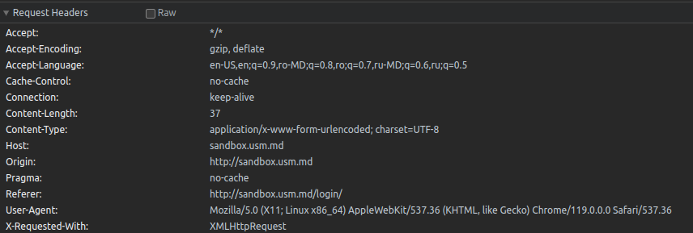
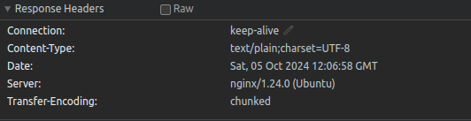

# Laborator 1: Bazele HTTP

## Sarcina Nr.1

### Ce metodă HTTP a fost utilizată pentru a trimite cererea?
* Pentru trimiterea cererei a fost utilizată metoda POST
### Ce anteturi au fost trimise în cerere?
* Anteturile trimise în răspuns:

### Ce parametri au fost trimiși în cerere?
* În cerere a fost transmis parametrul username cu valoarea student și parametrul password cu valoarea studentpass
### Ce cod de stare a fost returnat de server?
* Codul de stare returnat este 401 ce înseamnă că parametrii dați nu au trecut autentificarea
### Ce anteturi au fost trimise în răspuns?
* Anteturile trimise în răspuns:
  

